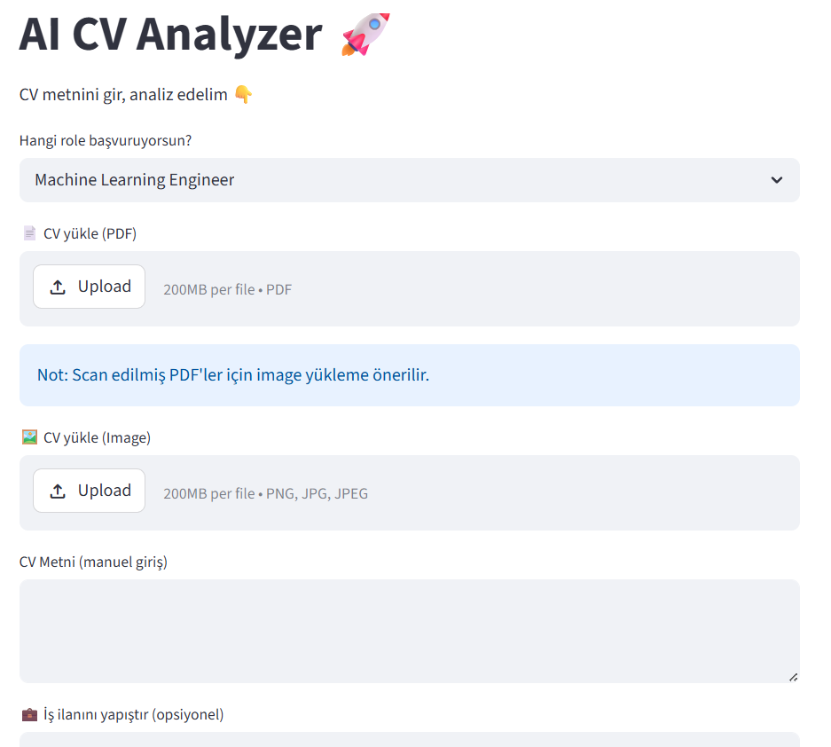

# 🚀 AI CV Analyzer

## 📸 Demo



An AI-powered web application that analyzes resumes (CVs) and provides feedback based on technical skills, selected job roles, and job descriptions.

---

## 📌 Features

* 🔍 **Role-Based Analysis**
  Analyze your CV based on a selected role (e.g., Machine Learning Engineer, Backend Developer)

* 📄 **PDF Resume Parsing**
  Extracts text from uploaded PDF resumes

* 🖼️ **Image OCR Support**
  Supports image-based CVs using OCR (Tesseract)

* 📊 **Skill Matching & Scoring**
  Calculates a score based on how well your CV matches required skills

* 🧠 **AI Feedback**
  Provides intelligent feedback based on your score

* 🎯 **Job Description Matching**
  Compare your CV with a job posting and see missing skills

---

## 🛠️ Tech Stack

* Python
* Streamlit
* Tesseract OCR
* pdfplumber
* PIL (Pillow)

---

## ⚙️ Installation

Clone the repository:

```bash
git clone https://github.com/nezihaucar/cv-analyzer.git
cd cv-analyzer
```

Install dependencies:

```bash
pip install -r requirements.txt
```

---

## ▶️ Run the App

```bash
streamlit run app.py
```

---

## ⚠️ Notes

* For image-based CVs, Tesseract OCR must be installed:
  https://github.com/tesseract-ocr/tesseract

* Some scanned PDFs may not contain extractable text.
  In such cases, uploading the CV as an image is recommended.

---

## 📈 Example Use Cases

* Students improving their resumes
* Job applicants checking skill gaps
* Matching CVs with job descriptions

---

## 👩‍💻 Author

**Neziha Uçar**
AI Engineering Student

---

## ⭐ Future Improvements

* Advanced NLP-based analysis
* Resume keyword optimization
* Deployment (Streamlit Cloud / Docker)

---


